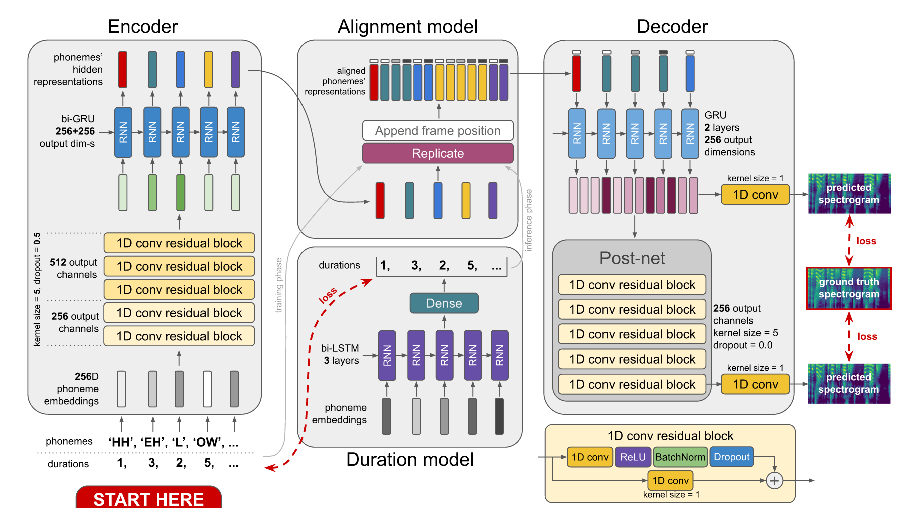
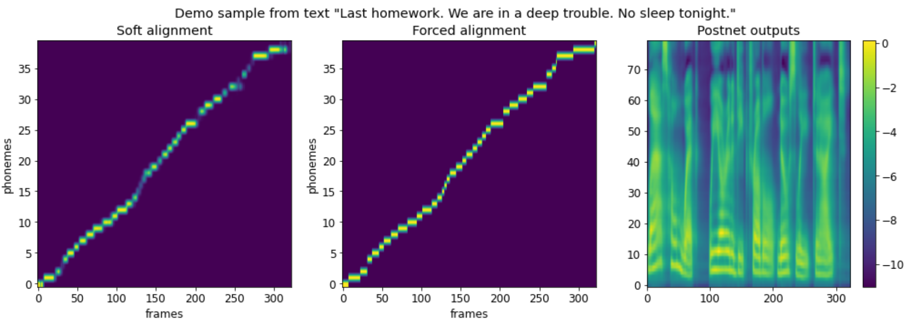

# DurIAN
Implementation of "Duration Informed Attention Network for Multimodal Synthesis" (https://arxiv.org/pdf/1909.01700.pdf) paper.

**Status**: released

# Info

DurIAN is encoder-decoder architecture for text-to-speech synthesis task. Unlike prior architectures like Tacotron 2 it doesn't learn attention mechanism but takes into account phoneme durations information. So, of course, to use this model one should have phonemized and duration-aligned dataset. However, you may try to use pretrained duration model on LJSpeech dataset (CMU dict used). Links will be provided below.

# Architecture details

DurIAN model consists of two modules: backbone synthesizer and duration predictor. However, current implementation contains baseline version and paper-based version.

## Baseline model



Here are some of the most notable differences from vanilla DurIAN:
* Prosodic boundary markers aren't used (didn't have them labeled), and thus there's no 'skip states' exclusion of prosodic boundaries' hidden states
* Style codes aren't used too (same reason)
* Simpler network architectures
* No Prenet in decoder
* No attention used in decoder
* Decoder's recurrent cell outputs single spectrogram frame at a time
* Decoder's recurrent cell isn't conditioned on its own outputs (isn't "autogressive")

## Vanilla version

* Prosodic boundary markers aren't used (we didn't have them labeled), and thus there's no 'skip states' exclusion of prosodic boundaries' hidden states
* Style codes aren't used too (same reason)
* Removed Prenet before CBHG encoder (didn't improved accuracy during experiments)

## Training

Both backbone synthesizer and duration model are trained simultaneously. For implementation simplifications duration model predicts alignment over the fixed max number of frames. You can learn this outputs as BCE problem, MSE problem by summing over frames-axis or to use both losses (haven't tested this one). Experiments showed that BCE-version of optimization process showed itself being unstable with longer text sequences, so prefer using MSE (don't mind if you get bad alignments in Tensorboard).

# Reproducibility



You can check the synthesis demo wavfile (was obtained much before convergence) in `demo` folder (used Waveglow vocoder).

1. First of all, make sure you have installed all packages using `pip install --upgrade -r requirements.txt`. The code is tested using `pytorch==1.5.0`

2. Clone the repository: `git clone https://github.com/ivanvovk/DurrIAN`, then `cd DurIAN` and `git submodule update --init` to clone audio processing files

3. To start training paper-based DurIAN version run `python train.py -c configs/default.json`. You can specify to train baseline model as `python train.py -c configs/baseline.json --baseline`

To make sure that everything works fine at your local environment you may run unit tests in `tests` folder by `python <test_you_want_to_run.py>`.

# Pretrained models

This implementation was trained using phonemized duration-aligned LJSpeech dataset with BCE duration loss minimization. You may find it via [this](https://drive.google.com/drive/folders/1eW9w7WHP2yp81-WafCpoOhvfDJSxckc_?usp=sharing) link.

# Dataset alignment problem

The main drawback of this model is requiring of duration-aligned dataset. You can find parsed LJSpeech filelist used in the training of current implementation in `filelists` folder. In order to use your data, make sure you have organized your filelists in the same way as provided LJSpeech ones. However, in order to save time and neurons of your brains you may try to train the model on your dataset without duration-aligning using the pretrained on LJSpeech duration model from my model checkpoint (didn't tried). But if you are interested in aligning personal dataset, carefully follow the next section.

## How to align your own data

In my experiments I aligned LJSpeech with [Montreal Forced Alignment](https://montreal-forced-aligner.readthedocs.io/en/latest/) tool. If here something will be unclear, please, follow instructions in toolkit's docs. To begin with, aligning algorithm has several steps:

1. Organize your dataset properly. MFA requires it to be in a single folder of structure {utterance_id.lab, utterance_id.wav}. Make sure all your texts are of `.lab` format.
2. Download MFA release and follow installation instructions via [this](https://montreal-forced-aligner.readthedocs.io/en/latest/installation.html) link.
3. Once done with MFA, you need your dataset words dictionary with phonemes transcriptions. Here you have several options:
   1. (Try this first) Download already done dictionary from [MFA pretrained models](https://montreal-forced-aligner.readthedocs.io/en/latest/pretrained_models.html) list (at the bottom of the page). In current implementation I have used English Arpabet dictionary. Here can be a problem: if your dataset contains some words missing in the dictionary, MFA may fail to parse it in the future and miss these files. You may skip them or try to preprocess your dataset with accordance to the dictionary or add missing words by hand (if not too much of them).
   2. You may generate the dictionary with pretrained G2P model from [MFA pretrained models](https://montreal-forced-aligner.readthedocs.io/en/latest/pretrained_models.html) list using the command `bin/mfa_generate_dictionary /path/to/model_g2p.zip /path/to/data dict.txt`. Notice, that default MFA installation will automatically provide you with English pretrained model, which you may use.
   3. In other cases, you'll need to train your own G2P model on your data. In order to train your model follow instructions via [this](https://montreal-forced-aligner.readthedocs.io/en/latest/g2p_model_training.html) link.
4. Once you have your data prepared, dictionary and G2P model, now you are ready for aligning. Run the command `bin/mfa_align /path/to/data dict.txt path/to/model_g2p.zip outdir`. Wait until done. `outdir` folder will contain a list of out of vocabulary words and a folder with special files of `.TextGrid` format, where wavs alignments are stored.
5. Now we want to process these text grid files in order to get the final filelist. Here you may find useful the python package `TextGrid`. Install it using `pip install TextGrid`. Here an example how to use it:

    ```
    import textgrid
    tg = textgrid.TextGrid.fromFile('./outdir/data/text0.TextGrid')
    ```

    Now `tg` is the set two objects: first one contains aligned words, second one contains aligned phonemes. You need the second one. Extract durations for whole dataset by iterating over obtained `.TextGrid` files and prepare a filelist in same format as the ones I provided in `filelists` folder.

I found an [overview](https://eleanorchodroff.com/tutorial/montreal-forced-aligner.html#overview-1) of several aligners. Maybe it will be helpful. However, I recommend you to use MFA as it has one of the best aligning accuracies, to my best knowledge.
